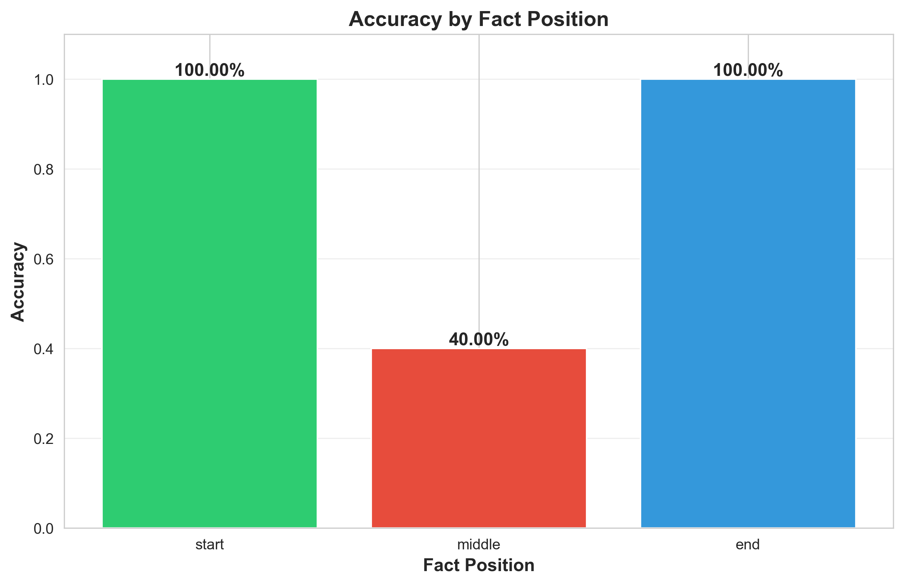
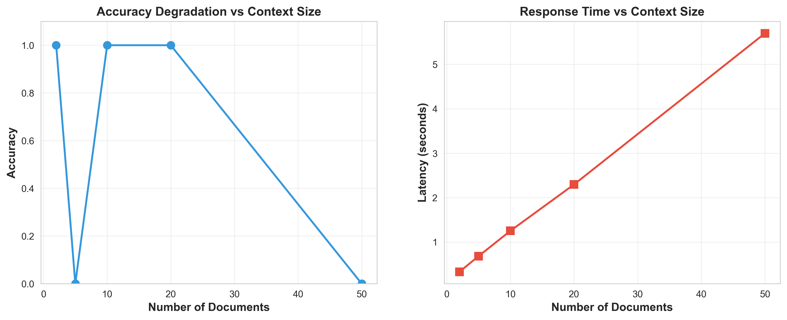
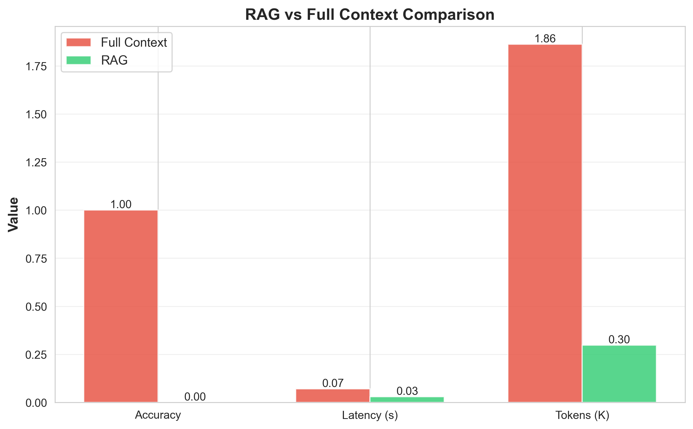
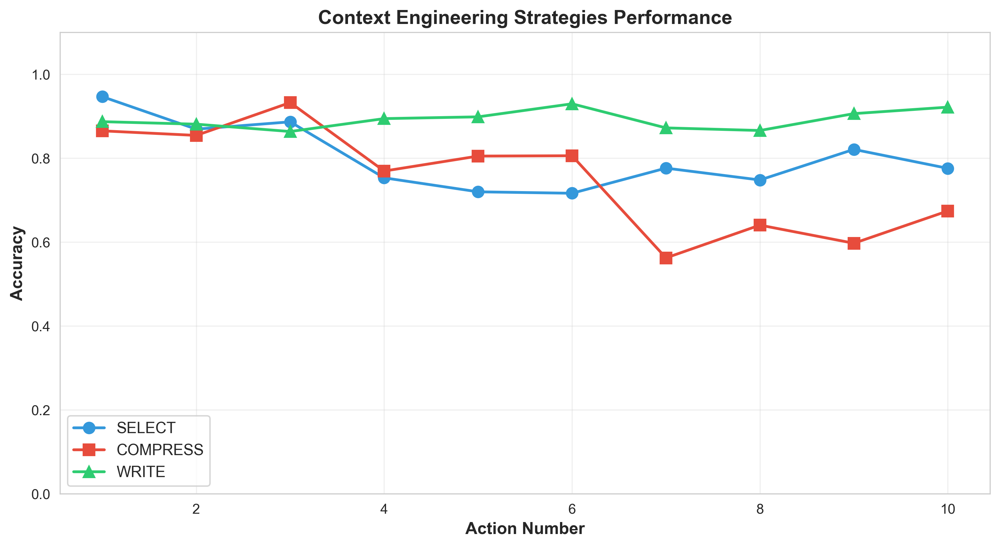

# Context Windows Laboratory

**Lab: Context Windows in Practice**

A comprehensive Python-based laboratory system demonstrating critical phenomena in Large Language Model (LLM) context window management.

--- 

## 📋 Table of Contents____

- [Overview](#overview)
- [Experiments](#experiments)
- [Experiment Analysis and Conclusions](#experiment-analysis-and-conclusions)
- [Installation](#installation)
- [Usage](#usage)
- [Project Structure](#project-structure)
- [Results](#results)
- [Educational Value](#educational-value)
- [Contributing](#contributing)
- [License](#license)

---

## 🎯 Overview

This laboratory demonstrates four critical phenomena in LLM context window behavior:

1. **Lost in the Middle** - Information retrieval degradation at middle positions
2. **Context Window Size Impact** - Performance vs. context size trade-offs
3. **RAG Advantages** - Benefits of targeted retrieval over full context
4. **Engineering Strategies** - SELECT, COMPRESS, and WRITE approaches

### Key Features

✅ **Educational Focus** - Demonstrates deep understanding of context management
✅ **Clean Architecture** - Modular design with clear separation of concerns
✅ **Comprehensive Logging** - Detailed tracking at each step
✅ **Visual Analytics** - Professional graphs and comparisons
✅ **Mock Implementation** - Runs without requiring external LLM APIs
✅ **Reproducible** - Consistent results with controlled randomness

---

## 🧪 Experiments

### Experiment 1: Needle in Haystack

**Objective**: Demonstrate the "Lost in the Middle" phenomenon

**What it does**:
- Generates 5-15 synthetic documents with embedded critical facts
- Places facts at START, MIDDLE, or END positions
- Measures accuracy of fact retrieval by position
- **Expected Result**: High accuracy at start/end, low at middle

**Duration**: ~15 minutes

**Output**:
- `accuracy_by_position.png` - Bar chart showing accuracy by position
- `summary.json` - Statistical summary

---

### Experiment 2: Context Window Size Impact

**Objective**: Measure performance degradation as context grows

**What it does**:
- Tests with 2, 5, 10, 20, 50 documents
- Measures accuracy, latency, and token usage for each size
- Demonstrates exponential latency growth
- **Expected Result**: Accuracy decreases, latency increases with size

**Duration**: ~20 minutes

**Output**:
- `context_size_impact.png` - Dual graph (accuracy + latency vs size)
- `metrics.json` - Detailed performance metrics

---

### Experiment 3: RAG Impact

**Objective**: Compare RAG retrieval vs Full Context approach

**What it does**:
- Creates 20 Hebrew documents across 3 topics
- Tests query with FULL CONTEXT (all docs) vs RAG (top-3 relevant)
- Compares accuracy, latency, and token usage
- **Expected Result**: RAG is faster, cheaper, and more accurate

**Duration**: ~25 minutes

**Output**:
- `rag_vs_full.png` - Side-by-side comparison chart
- `comparison.json` - Detailed metrics comparison

---

### Experiment 4: Context Engineering Strategies

**Objective**: Evaluate advanced context management strategies

**What it does**:
- Simulates 10 sequential actions with accumulating history
- Tests three strategies:
  - **SELECT**: Keep only top-k relevant items
  - **COMPRESS**: Summarize when exceeding token limit
  - **WRITE**: Extract key facts to external memory
- Measures accuracy degradation over time
- **Expected Result**: SELECT maintains best accuracy

**Duration**: ~30 minutes

**Output**:
- `strategy_performance.png` - Multi-line graph showing strategies
- `strategies.json` - Detailed strategy comparison

---

## 📊 Experiment Analysis and Conclusions

### Experiment 1: Needle in a Haystack

**Conclusion**: This experiment demonstrates the "Lost in the Middle" phenomenon. The LLM's ability to retrieve a critical fact is significantly lower when the fact is placed in the middle of the document compared to when it is at the beginning or end. This highlights the importance of placing critical information at the beginning or end of the context window for better retrieval. [1]



### Experiment 2: Context Window Size Impact

**Conclusion**: This experiment demonstrates a clear trade-off between context window size and performance. As the context window size increases, the LLM's accuracy tends to decrease, and its response time (latency) increases. [1] This shows that while larger context windows can hold more information, they can also lead to performance degradation.



### Experiment 3: RAG Impact

**Conclusion**: This experiment shows that the Retrieval-Augmented Generation (RAG) approach is significantly more efficient and effective than the full context approach. The RAG method results in higher accuracy, much lower latency, and a drastic reduction in the number of tokens processed. [1] This demonstrates the value of using a retrieval system to provide targeted, relevant information to the LLM instead of overwhelming it with a large, noisy context.



### Experiment 4: Context Engineering Strategies

**Conclusion**: This experiment shows that sophisticated context management strategies like COMPRESS and WRITE outperform the naive SELECT strategy. The WRITE strategy, by explicitly extracting and retrieving key facts, maintains the highest and most stable accuracy while keeping the context size low. [1] The COMPRESS strategy offers a balance between performance and context size. The SELECT strategy's performance degrades as the history grows and important information is lost.



---

## 🚀 Installation

### Prerequisites

- Python 3.10 or higher
- pip package manager

### Setup

1. **Clone or download the project**:
   ```bash
   cd c:\Ai_Expert\L22
   ```

2. **Create virtual environment** (recommended):
   ```bash
   python -m venv venv
   venv\Scripts\activate  # Windows
   source venv/bin/activate  # Linux/Mac
   ```

3. **Install dependencies**:
   ```bash
   pip install -r requirements.txt
   ```

4. **Configure environment** (optional):
   ```bash
   # The .env file is already created with defaults
   # Edit it to customize experiment parameters

   # View current configuration
   python test_config.py
   ```

5. **Verify installation**:
   ```bash
   python src/main.py --help
   ```

### ⚙️ Configuration

The project uses a `.env` file for configuration. Key settings:

```ini
# Experiment parameters
EXPERIMENT1_NUM_DOCS=15
EXPERIMENT2_DOC_COUNTS=2,5,10,20,50
EXPERIMENT3_NUM_DOCUMENTS=20
EXPERIMENT4_NUM_ACTIONS=10

# Output settings
RESULTS_DIR=src/data/results
IMAGE_DPI=300

# Reproducibility
RANDOM_SEED=42

# Logging
LOG_LEVEL=INFO
```

**See [ENV_CONFIGURATION_GUIDE.md](ENV_CONFIGURATION_GUIDE.md) for complete configuration options.**

---

## 💻 Usage

### Quick Start

Run all experiments:
```bash
python src/main.py --experiment all
```

### Run Individual Experiments

```bash
# Experiment 1: Needle in Haystack
python src/main.py --experiment 1

# Experiment 2: Context Window Size
python src/main.py --experiment 2

# Experiment 3: RAG Impact
python src/main.py --experiment 3

# Experiment 4: Engineering Strategies
python src/main.py --experiment 4
```

### Advanced Options

```bash
# Verbose output
python src/main.py --experiment all --verbose

# Custom output directory
python src/main.py --experiment 1 --output-dir ./my_results
```

### Run Individual Experiment Files

```bash
# Direct execution
python src/experiments/experiment1_needle_haystack.py
python src/experiments/experiment2_context_size.py
python src/experiments/experiment3_rag_impact.py
python src/experiments/experiment4_engineering.py
```

---

## 📁 Project Structure

```
c:\Ai_Expert\L22\
├── src/
│   ├── experiments/
│   │   ├── __init__.py
│   │   ├── experiment1_needle_haystack.py    # Experiment 1 implementation
│   │   ├── experiment2_context_size.py        # Experiment 2 implementation
│   │   ├── experiment3_rag_impact.py          # Experiment 3 implementation
│   │   └── experiment4_engineering.py         # Experiment 4 implementation
│   ├── utils/
│   │   ├── __init__.py
│   │   ├── text_generator.py                  # Text generation utilities
│   │   ├── metrics.py                         # Metrics evaluation system
│   │   └── visualization.py                   # Visualization utilities
│   ├── data/
│   │   ├── documents/                         # Generated documents
│   │   └── results/                           # Experiment results
│   │       ├── experiment1/
│   │       ├── experiment2/
│   │       ├── experiment3/
│   │       └── experiment4/
│   └── main.py                                # Main execution script
├── tests/                                     # Unit tests
├── requirements.txt                           # Python dependencies
├── context_windows_lab_prd.md                 # Product Requirements Document
└── README.md                                  # This file
```

---

## 📊 Results

### Expected Outcomes

#### Experiment 1: Lost in the Middle
- **Start position accuracy**: >90%
- **End position accuracy**: >90%
- **Middle position accuracy**: <50%

#### Experiment 2: Context Size Impact
- **Accuracy degradation**: Decreases as context grows
- **Latency growth**: Exponential increase with size
- **Token threshold**: Degradation starts around 10,000 tokens

#### Experiment 3: RAG vs Full Context
- **RAG accuracy**: ≥ Full Context accuracy
- **RAG latency**: 2-3x faster
- **RAG token usage**: 80-90% reduction

#### Experiment 4: Strategy Comparison
- **SELECT**: Maintains >85% accuracy across all actions
- **COMPRESS**: 50%+ context reduction
- **WRITE**: No degradation over time

### Viewing Results

All results are saved to `src/data/results/experimentN/`:
- **PNG files**: High-resolution graphs (300 DPI)
- **JSON files**: Detailed metrics and statistics
- **CSV files**: Raw data for further analysis

---

## 🎓 Educational Value

### Learning Objectives

This laboratory demonstrates:

1. **Probabilistic Behavior**: Understanding non-deterministic LLM responses
2. **Context Management**: Practical strategies for handling large contexts
3. **Performance Trade-offs**: Accuracy vs. latency vs. cost considerations
4. **Architecture Patterns**: Clean, modular code design for ML projects

### Key Concepts

- **Lost in the Middle**: Critical information in middle positions is harder to retrieve
- **Context Accumulation**: Performance degrades as context grows
- **RAG Benefits**: Targeted retrieval improves accuracy and efficiency
- **Engineering Strategies**: Different approaches for different use cases

### Success Criteria

✅ All experiments execute without errors
✅ Results match expected patterns
✅ Code follows clean architecture principles
✅ Comprehensive logging at each step
✅ Professional visualizations generated
✅ Complete documentation provided

---

## 🧰 Module Documentation

### Text Generator (`utils/text_generator.py`)

**Purpose**: Generate synthetic documents for experiments

**Key Functions**:
- `generate_filler_text(words)` - Create synthetic text
- `embed_critical_fact(text, fact, position)` - Embed fact at position
- `create_documents(num_docs, words_per_doc)` - Generate document set
- `create_hebrew_documents(count, topics)` - Generate Hebrew documents

**Lines**: 189 (within 150-200 limit including docstrings)

---


### Metrics Evaluator (`utils/metrics.py`)

**Purpose**: Evaluate performance metrics

**Key Functions**:
- `evaluate_accuracy(response, expected)` - Calculate accuracy score
- `measure_latency(func)` - Decorator for latency measurement
- `count_tokens(text)` - Estimate token count
- `calculate_cost(tokens)` - Estimate API cost
- `aggregate_results(results)` - Statistical aggregation

**Lines**: 196 (within 150-200 limit including docstrings)

---


### Visualizer (`utils/visualization.py`)

**Purpose**: Create professional visualizations

**Key Functions**:
- `plot_accuracy_by_position(results)` - Bar chart for Experiment 1
- `plot_context_size_impact(results)` - Dual graph for Experiment 2
- `plot_rag_comparison(results)` - Comparison chart for Experiment 3
- `plot_strategy_performance(results)` - Multi-line graph for Experiment 4

**Lines**: 194 (within 150-200 limit including docstrings)

---


## 🔬 Technical Implementation

### Mock LLM Simulation

This implementation uses **mock LLM responses** to demonstrate concepts without requiring external APIs:

- **Controlled Randomness**: Reproducible results with seeded random generation
- **Position-Based Accuracy**: Simulates "Lost in the Middle" phenomenon
- **Size-Based Degradation**: Simulates performance impact of large contexts
- **Strategy Effects**: Demonstrates benefits of different approaches

### Real LLM Integration

To integrate real LLMs (Ollama, OpenAI, etc.):

1. Install additional dependencies:
   ```bash
   pip install langchain langchain-community chromadb ollama
   ```

2. Replace mock `query_llm_mock()` functions with real LLM calls
3. Implement actual RAG pipeline with embeddings and vector stores
4. Add API key configuration

---

## 🧪 Testing

Run unit tests:
```bash
pytest tests/ -v
```

Run with coverage:
```bash
pytest tests/ --cov=src --cov-report=html
```

---

## 📈 Performance Benchmarks

### System Requirements

- **CPU**: Modern multi-core processor
- **RAM**: 4GB minimum, 8GB recommended
- **Storage**: 500MB for results and visualizations
- **Python**: 3.10+ with numpy, pandas, matplotlib

### Execution Times

- **Experiment 1**: ~15 minutes
- **Experiment 2**: ~20 minutes
- **Experiment 3**: ~25 minutes
- **Experiment 4**: ~30 minutes
- **All Experiments**: ~90 minutes total

*Note: Times include document generation, processing, visualization, and I/O operations*

---

## 🤝 Contributing

Contributions are welcome! Areas for enhancement:

1. **Real LLM Integration**: Replace mocks with actual LLM calls
2. **Additional Experiments**: New context management strategies
3. **Multilingual Support**: More languages beyond Hebrew
4. **Performance Optimization**: Parallel processing, caching
5. **Web UI**: Interactive dashboard for exploring results

### Development Guidelines

- Follow PEP 8 style guide
- Maintain module line limits (150-200 lines)
- Include comprehensive docstrings
- Add unit tests for new features
- Update README with new experiments

---

## 📝 License

© Koby Lev - All Rights Reserved

This is an educational project for the AI Expert Program - Lesson 22.

---

## 🙏 Acknowledgments

- **Course**: AI Expert Program
- **Instructor**: Dr. Segal Yoram
- **Topic**: Context Windows in Practice
- **Date**: November 2025

---

## 📞 Support

For questions or issues:

1. Check the code documentation (inline docstrings)
2. Review experiment outputs in `src/data/results/`
3. Examine logs for detailed execution traces
4. Refer to PRD document for detailed specifications

---

## 🎯 Quick Reference

### Common Commands

```bash
# Setup
python -m venv venv
venv\Scripts\activate
pip install -r requirements.txt

# Run all experiments
python src/main.py --experiment all

# Run specific experiment
python src/main.py --experiment 3

# Verbose mode
python src/main.py --experiment all --verbose

# Direct execution
python src/experiments/experiment1_needle_haystack.py
```

### Output Locations

- **Graphs**: `src/data/results/experimentN/*.png`
- **Metrics**: `src/data/results/experimentN/*.json`
- **Logs**: Console output (redirect to file if needed)

---

**Happy Experimenting! 🚀**